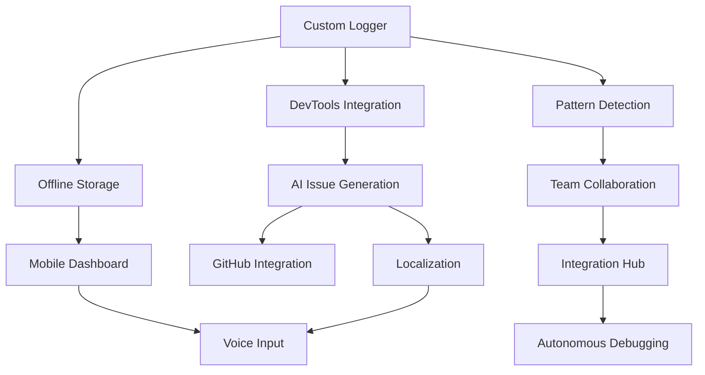

# 📋 Mosqit Features List

> Comprehensive feature documentation for the Mosqit Chrome Extension

## Core Features

### 1. 🪵 Custom Logger (`mosqit.log`)
**Priority:** P0 - Critical
**Status:** Not Started
**Complexity:** High

#### Description
Advanced console logging system that extends native `console.log` and `console.error` with rich metadata capture.

#### Technical Details
- **Stack Trace Parsing**: Extracts file path and line number using regex patterns
- **Dependency Analysis**: Scans `package.json` and imports with acorn-jsx
- **DOM Context Capture**: Links errors to specific DOM elements
- **Framework Support**: React, Vue, Svelte, Vanilla JavaScript

#### Metadata Schema
```javascript
{
  message: string,
  file: string,           // e.g., "src/components/Button.js"
  line: number,           // e.g., 25
  deps: string[],         // e.g., ["react@18.3.1", "styled-components@6.0.0"]
  domNode: {
    tag: string,          // e.g., "button"
    class: string,        // e.g., "submit-btn"
    html: string          // e.g., "<button class='submit-btn'>Submit</button>"
  },
  timestamp: number,
  severity: 'log' | 'warn' | 'error',
  analysis: string        // AI-generated context
}
```

#### Success Metrics
- Metadata capture accuracy: ≥95%
- Log capture latency: ≤50ms
- Storage efficiency: ≤100KB per 100 logs

---

### 2. 📸 DevTools DOM Preview Integration
**Priority:** P0 - Critical
**Status:** Not Started
**Complexity:** High

#### Description
Captures screenshots and DOM element details from Chrome DevTools Elements panel with visual highlighting.

#### Technical Details
- **DOM Inspection**: Uses `chrome.devtools.inspectedWindow.eval()`
- **Screenshot Capture**: `chrome.tabs.captureVisibleTab()`
- **Element Mapping**: AST-based DOM-to-code correlation
- **Image Optimization**: Downscale to 512x512px for performance

#### Features
- Hover-to-highlight UI elements
- One-click screenshot capture
- Automatic DOM node extraction
- Visual bug annotation support

#### Success Metrics
- DOM-to-code mapping accuracy: ≥95%
- Screenshot processing latency: ≤1.2s
- Image compression ratio: ≥60%

---

### 3. 🤖 AI-Powered GitHub Issue Generation
**Priority:** P0 - Critical
**Status:** Not Started
**Complexity:** Very High

#### Description
Generates comprehensive GitHub issues using Chrome's built-in AI APIs with context from logs, screenshots, and code.

#### Chrome AI APIs Used
1. **Prompt API (Multimodal)**
   - Analyzes logs and screenshots
   - Maps errors to code context
   - Suggests root causes

2. **Writer API**
   - Creates issue templates
   - Generates descriptions
   - Formats markdown

3. **Rewriter API**
   - Refines issue descriptions
   - Improves clarity
   - Suggests fixes

4. **Translator API**
   - Localizes issues (5+ languages)
   - Preserves technical terms
   - Adapts to regional conventions

5. **Summarizer API**
   - Condenses error patterns
   - Groups related issues
   - Creates executive summaries

#### Issue Template Structure
```markdown
**Issue**: [Title]
**Type**: Bug | Performance | UI/UX
**Severity**: Critical | High | Medium | Low
**DOM Node**: [HTML element]
**File**: [Path:Line]
**Dependencies**: [Package list]
**Browser**: [Chrome version]
**Framework**: [React/Vue/Svelte]

**Description**:
[Detailed description]

**Steps to Reproduce**:
1. [Step 1]
2. [Step 2]

**Expected Behavior**:
[What should happen]

**Actual Behavior**:
[What actually happens]

**Screenshot**:


**Suggested Fix**:
[AI-generated solution]

**Related Issues**:
- #[Issue number]
```

#### Success Metrics
- Issue completeness: ≥90%
- Generation time: ≤2s
- Fix suggestion accuracy: ≥70%

---

### 4. 💾 Offline Resilience & Storage
**Priority:** P0 - Critical
**Status:** Not Started
**Complexity:** Medium

#### Description
Comprehensive offline support with intelligent caching and data persistence.

#### Storage Architecture
- **IndexedDB**: Primary storage (50MB quota)
- **Chrome Storage API**: Settings and preferences
- **Compression**: zlib.js for ~60% savings
- **Encryption**: AES-256 for sensitive data

#### Cached Data Types
1. **Logs**: All mosqit.log outputs
2. **Screenshots**: DevTools captures
3. **Code Files**: GitHub repository cache
4. **Issue Drafts**: Unsaved issues
5. **AI Context**: Analysis results
6. **User Preferences**: Settings

#### Sync Strategy
- Queue-based sync when online
- Conflict resolution (last-write-wins)
- Explicit consent for uploads
- Incremental updates

#### Success Metrics
- Storage efficiency: ≥60% compression
- Cache hit rate: ≥80%
- Sync reliability: ≥99%

---

### 5. 📱 Hybrid Mobile Dashboard
**Priority:** P1 - Important
**Status:** Not Started
**Complexity:** High

#### Description
Next.js-powered dashboard for mobile QA workflows with real-time sync.

#### Features
- **Real-time Log Viewer**: Live log streaming
- **Issue Management**: Create, edit, track issues
- **Voice Input**: Speech-to-text for issue creation
- **Mobile Extension**: Kiwi Browser support
- **Firebase Sync**: Optional cloud backup

#### Dashboard Pages
1. **/dashboard**: Overview and analytics
2. **/logs**: Real-time log viewer
3. **/issues**: Issue management
4. **/projects**: Multi-project support
5. **/settings**: Configuration

#### Mobile-Specific Features
- Touch-optimized UI
- Offline-first architecture
- Progressive Web App (PWA)
- Push notifications

#### Success Metrics
- Mobile performance score: ≥90 (Lighthouse)
- Voice input accuracy: ≥85%
- Sync latency: ≤500ms

---

### 6. 🌍 Global Accessibility & Localization
**Priority:** P1 - Important
**Status:** Not Started
**Complexity:** Medium

#### Description
Multi-language support and accessibility features for global teams.

#### Supported Languages (Launch)
1. English (en-US)
2. Spanish (es-ES)
3. Hindi (hi-IN)
4. Mandarin (zh-CN)
5. French (fr-FR)

#### Accessibility Features
- **WCAG 2.1 AA Compliance**
- **Keyboard Navigation**: Full support
- **Screen Readers**: ARIA labels
- **High Contrast Mode**: Theme support
- **Font Scaling**: Responsive typography

#### Localization Strategy
- Chrome i18n API integration
- Technical term preservation
- Cultural adaptation
- Right-to-left (RTL) support

#### Voice Input Support
- Multi-language recognition
- Command shortcuts
- Dictation mode
- Noise cancellation

#### Success Metrics
- Translation accuracy: ≥95%
- Accessibility score: 100 (Lighthouse)
- Voice recognition accuracy: ≥85%

---

## Advanced Features

### 7. 🔍 Smart Error Pattern Detection
**Priority:** P2 - Nice to Have
**Status:** Not Started
**Complexity:** Medium

#### Description
AI-driven pattern recognition for recurring errors and root cause analysis.

#### Features
- Error clustering
- Trend analysis
- Predictive debugging
- Performance anomaly detection

---

### 8. 👥 Team Collaboration
**Priority:** P2 - Nice to Have
**Status:** Not Started
**Complexity:** High

#### Description
Real-time collaboration features for distributed teams.

#### Features
- Shared debugging sessions
- Comment threads on logs
- @mentions in issues
- Team analytics dashboard

---

### 9. 🔗 Integration Hub
**Priority:** P3 - Future
**Status:** Not Started
**Complexity:** Very High

#### Description
Third-party integrations for enhanced workflow.

#### Planned Integrations
- Slack notifications
- JIRA sync
- VS Code extension
- CI/CD pipelines

---

### 10. 🤖 Autonomous Debugging (Future)
**Priority:** P3 - Future
**Status:** Not Started
**Complexity:** Very High

#### Description
Model Context Protocol (MCP) integration for automated fixes.

#### Features
- Auto-fix generation
- Code review suggestions
- Test case creation
- Documentation updates

---

## Feature Dependencies



## Implementation Priority Matrix

| Priority | Features | Timeline | Effort |
|----------|----------|----------|--------|
| **P0 - Critical** | Custom Logger, DevTools Integration, AI Issues, Offline Storage | Weeks 1-4 | High |
| **P1 - Important** | Mobile Dashboard, Localization, GitHub Integration | Weeks 5-6 | Medium |
| **P2 - Nice to Have** | Pattern Detection, Team Collaboration | Weeks 7-8 | Low |
| **P3 - Future** | Integration Hub, Autonomous Debugging | Post-Hackathon | Very High |

## Success Criteria

### Technical Metrics
- **Performance**: All operations ≤2s
- **Accuracy**: ≥95% for core features
- **Reliability**: ≥99.9% uptime
- **Storage**: ≤50MB usage

### User Metrics
- **Adoption**: 1000+ users in 3 months
- **Satisfaction**: ≥90% positive feedback
- **Engagement**: Daily active usage
- **Retention**: ≥70% after 30 days

### Business Metrics
- **Debugging Time**: ≥50% reduction
- **Issue Resolution**: ≥30% faster
- **Team Collaboration**: ≥40% improvement
- **Cost Savings**: ≥$10K/year per team

---

*Last Updated: September 2025*
*Version: 1.0*